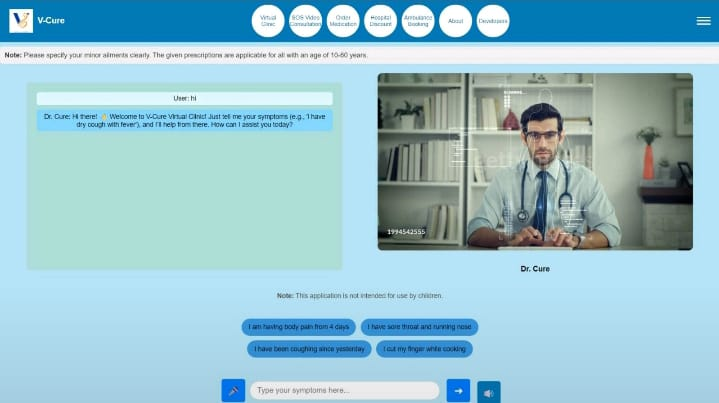
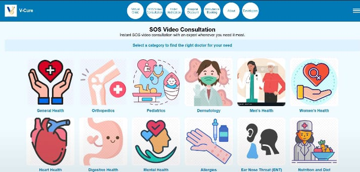

# 🏥 Virtual Clinic

**Virtual Clinic** is a user-friendly and responsive web platform designed to streamline online medical consultations and healthcare services for both doctors and patients. It enables secure registration, login, appointment scheduling, and document uploads — all in one place.

## 📸 Screenshots

### 🧑‍⚕️ Virtual Consultation Chat with Dr. Cure


### 📋 SOS Video Consultation & Specializations


---

## 🔑 Key Features

### 👩‍⚕️ Doctor Portal
- Doctor registration with medical license upload (image/PDF)
- Select specialization, availability, and location
- Secure login and profile management
- View appointments and patient details

### 🧑‍💻 Client Portal
- Client registration and secure login
- Search and book appointments with available doctors
- Upload relevant health documents
- SOS video consultation option

### 🌐 Homepage
- Logo and menu bar with smooth navigation
- Quick access to Register/Login for both clients and doctors
- Circular icons for features: Virtual Clinic, SOS Consultation, Order Medication, etc.
- Recommendations and symptom-based search

### 📱 UI/UX
- Responsive design across devices
- Floating label inputs and enhanced spacing
- Dark/light mode ready
- Clean layout with soft shadows and smooth transitions

## 🧰 Tech Stack

- **Frontend:** HTML, CSS, JavaScript
- **Backend:** PHP (register.php, login.php, doctor_login.php, etc.)
- **Database:** MySQL
- **Tools & Libraries:** FontAwesome, Bootstrap (optional), custom JS/CSS

## 🖥️ Setup Instructions

1. **Clone the Repository**
```bash
git clone https://github.com/firdoseara/virtual-clinic.git
cd virtual-clinic
````

2. **Start Local Server (XAMPP / WAMP / MAMP)**

   * Place the project folder in your `htdocs` (XAMPP) or equivalent.
   * Start Apache and MySQL.
   * Import the SQL file into phpMyAdmin.

3. **Open in Browser**

```
http://localhost/virtual-clinic/index.html
```

4. **Database Configuration**

   * Make sure your `login.php`, `register.php`, etc., are correctly connected to the MySQL database.
   * Update credentials in the PHP files if needed.

## 🧩 Planned Enhancements

* Real-time chat/video integration
* Appointment reminder notifications
* Admin dashboard for platform management
* AI-powered symptom checker
* Better file validation and email verification

## 🤝 Contributing

Pull requests and feature suggestions are welcome! Please open an issue first to discuss significant changes.

## 📄 License

[MIT License](LICENSE)

---

### 👩‍💻 Developed by Firdose Ara (me) and my team

> Student, AI & Data Science, Shridevi Institute of Engineering and Technology
> Ready for internships and job opportunities in Data Science and AI.

---

**Virtual Clinic — Bringing Healthcare to Your Fingertips.**


